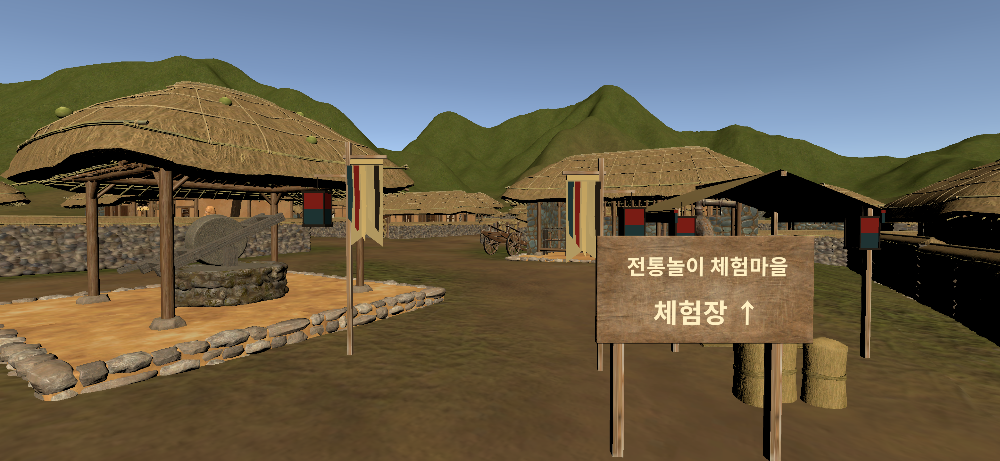

# 전통마을 입구 길 안내 — 현재 상태와 다음 작업 인계

최종 갱신: 2026-09-11 (KST). 프로젝트: `D:/work/ModooTraditionalPlay`.
이 문서는 최신 상태 기준이며, 과거 작업 경위는 [WORKLOG.md](WORKLOG.md)를 참고한다. 과거 로그의 Unlit 적용 기록은 아래 Lit 점검 결과로 대체된다.

## 사용자 확정 지침

- Unity MCP로 실제 Editor 상태를 확인하고 한국어로 짧게 보고한 뒤 수정한다. 경로·Transform·방향을 추측하지 않는다.
- 유일한 대상 Scene은 `Assets/Scenes/main_playoursound.unity`. 장구·사방치기 Scene은 열거나 저장하지 않는다.
- XR Rig Transform, XR 이동/Interaction, Terrain, KHS 환경, 건축물, 전체 Lighting, 기존 Manager와 게임 로직을 보존한다.
- **별도 Scene 백업 파일을 만들지 않는다.** 사용자는 Git 커밋으로 백업과 이력을 관리할 예정이다. 현재 커밋·푸시는 실행하지 않았다.
- **Unlit 적용이나 조명 반응을 바꾸는 우회 조치는 사전에 사용자에게 이유와 영향을 설명하고 확인받는다.** 사용자가 직접 수정한 Lit 상태를 유지한다.
- 잔치 중인 마을에서 잔치하는 집으로 초대받는 분위기. 한국적인 깃발·천막·청사초롱·잔칫상으로 길을 유도한다. 스토리는 미확정이며 추후 요청에 맞춰 조정한다.
- 현재 승인 범위는 입구에서 두 게임장까지 깃발 안내와 두 문의 컨트롤러 트리거 Scene 전환이다. 사용자 직접 이동/삭제 상태를 우선 보존한다.
- 신규 패키지·안내 프레임워크 추가 금지. 사용자 요청으로 기존 글꼴/제공 에셋 도입 및 문 전용 DoorSceneTransition 런타임 스크립트와 목적지 Build Settings 등록은 승인 범위에 포함된다.

## 확인된 프로젝트와 목적지

- Unity `6000.3.10f1`, XR Interaction Toolkit `3.3.1`.
- XR Rig: `XR Origin Hands (XR Rig)`.
- 카메라: `XR Origin Hands (XR Rig)/Camera Offset/Main Camera`.
- 기존 이동 구조: LocomotionMediator/XRBodyTransformer, DynamicMoveProvider, 회전·텔레포트·중력·점프·등반 관련 컴포넌트. 설정 변경 없음.
- Terrain: `AllLevel/Terrain`, Terrain 및 TerrainCollider 활성, sharedMaterial 없음.
- Terrain Asset: `Assets/Naganeupseong/Scene/Resource/Terrain.asset`.

| 실제 게임 시작 문 | 게임 | 확인한 World Position |
|---|---|---|
| `AllLevel/Door01k (3)` | **장구** | `(466.2, 10.36167, 664.685)` |
| `AllLevel/Door01k (7)` | **사방치기** | `(488.722, 10.04, 663.085)` |

문 번호는 사용자 정정 반영 결과다. 입구 안내판에서는 게임별 분기를 안내하지 않는다.

## XR 기준점 — 변경 금지

작업 전후 동일한 값:

| 항목 | 값 |
|---|---|
| Position | `(450.5939, 9.55, 709.6385)` |
| Rotation Euler | `(1.30743086, 148.6813, -0.000296923739)` |
| Scale | `(1, 1, 1)` |
| Rotation Quaternion | `(-0.003077056957408786, -0.962820827960968, 0.010986467823386193, -0.26989975571632388)` |
| Camera forward | `(0.5196626, -0.0228169933, -0.854066849)` |

표의 반올림 값으로 Transform을 다시 대입하지 않는다. 다음 작업 시작 시 실제 직렬화 값을 읽고 전후 비교한다. 기존 Euler hint와 표시 Euler가 다를 수 있다.

## 구현 상태

```text
RouteGuide
└─ Entrance
   ├─ EntranceGuideSign
   │  ├─ WoodenFace_ReusedKitchenBoard
   │  ├─ Post_L / Post_R
   │  └─ VillageTitle / DestinationArrow
   ├─ EntranceFlag_L
   ├─ EntranceFlag_R
   ├─ Barrier_R
   │  └─ RiceStraw_1..3
   └─ FeastCanopy
      ├─ ClothRoof_Placeholder / TimberPost들
      ├─ IndigoValance / RedBinding / RidgePole
      ├─ CanopyLantern_L / CanopyLantern_R
      └─ FeastStrawMat / 소반 2개 / 그릇 2개
```

깃발에는 오방색 리본과 청사초롱 장식이 있다. 청사초롱은 총 4개이며 Light를 추가하지 않았다. 깃발·천막·등은 단순 제작 형태로, 최종 미술 에셋 교체 후보다.
`Barrier_L`, `CommonRoute`, `GameAreaJunction`, `JangguRoute`, `SabangchigiRoute`는 생성하지 않았다.

| 오브젝트 | World Position | Y 회전 | Scale |
|---|---|---|---|
| EntranceGuideSign | `(450.92746, 8.710405, 705.627441)` | `148.6813` | `(1,1,1)` |
| EntranceFlag_L | `(455.298767, 9.043716, 705.946045)` | `148.6813` | `(1,1,1)` |
| EntranceFlag_R | `(452.308746, 8.824467, 704.1268)` | `148.6813` | `(1,1,1)` |
| Barrier_R | `(450.117462, 8.656576, 703.4958)` | `148.6813` | `(1,1,1)` |
| FeastCanopy | `(450.7855, 8.8494, 700.8588)` | `148.6813` | `(1,1,1)` |

- 안내 문구: `전통놀이 체험마을` / `체험장 ↑`.
- 안내면 약 1.90 × 0.95m, 중심 높이 로컬 1.6m, 시작점과 수평거리 약 4.02m.
- 깃발 기둥 사이 3.50m, 천 사이 약 2.54m.
- 가이드 Collider 총 14개: 안내면 1, 안내판 기둥 2, 깃발 기둥 2, 짚단 3, 천막 기둥 4, 소반 2. 천·등에 Collider 없음.

## 재질 점검 — 2026-09-04

아래 경로는 모두 `Assets/RouteGuide/Entrance/` 기준이다. 추가한 일반 `.mat` 6개 및 실제 Renderer 연결을 Unity MCP로 확인했다. **6개 모두 `Universal Render Pipeline/Lit`, Emission 비활성**이다.

| 재질 파일 | 현재 상태 |
|---|---|
| Entrance_Indigo_Cloth.mat | Lit |
| Entrance_Ivory_Trim.mat | Lit |
| Festival_Canopy_Cloth.mat | 사용자가 직접 Lit으로 변경한 상태를 저장 |
| Festival_Dark_Wood.mat | Lit |
| Festival_Red_Cloth.mat | Lit |
| Festival_Unbleached_Cloth.mat | Lit |

글자는 `TextMeshPro/Mobile/Distance Field` 전용 셰이더를 유지한다. 이를 일반 장식 재질로 간주해 Lit으로 일괄 변환하지 않는다. 기존 목재 `Assets/Naganeupseong/Resource/Materials/M_Kitchen_Board.mat`도 기존 셰이더를 유지한다.

현재 Lit 상태의 시작 카메라 이미지:



## 사용 에셋과 변경 파일

기존 재사용 Prefab은 `Assets/Naganeupseong/Prefabs/Prop/` 아래:

- `Kitchen_Board.prefab`, `Rice_Straw.prefab`
- `Small_Dining_Table.prefab`, `Straw_Mat01a.prefab`, `Bibimbap01a.prefab`

작업 변경 경로:

- `Assets/Scenes/main_playoursound.unity`
- `Assets/RouteGuide/Entrance/`의 위 재질 6개와 각 `.meta`
- 같은 폴더의 `Entrance_Swallowtail_Placeholder.asset`, `Festival_Hanging_Ribbon.asset`, `Festival_Cloth_Canopy.asset` 및 `.meta`
- `Assets/RouteGuide/Entrance/Fonts/NotoSansKR-Bold.otf`, `OFL.txt`, `Entrance_NotoSansKR_Bold_SDF.asset` 및 `.meta`
- 신규 폴더에 대응하는 `.meta`
- `docs/entrance-route-guide/HANDOFF.md`, `WORKLOG.md`, `images/20260904-lit-current.png`

글꼴은 Noto Sans KR Bold, SIL Open Font License. TMP SDF는 현재 문구용 정적 글리프이므로 문구 변경 시 한글·화살표 누락을 확인한다. 공식 출처: https://github.com/notofonts/noto-cjk/blob/main/Sans/SubsetOTF/KR/NotoSansKR-Bold.otf

## 검증과 남은 한계

- 기존 배치 작업에서 Scene View와 Game View 확인, 원본 Scene 저장·재열기 확인.
- XR Transform, 기존 환경·이동 설정 보존. 다른 게임 Scene 및 Build Settings 해시 유지 확인.
- 입구 전방 8m를 0.25m 간격 33지점, 반지름 0.3m/높이 1.8m 캡슐로 검사해 장애물 0 확인.
- 이번 Lit 점검에서 추가 일반 재질 6개 확인 및 사용자 변경 저장, 시작 카메라 이미지 갱신.
- Console Error 0 / Warning 0 확인. Console을 지우지 않았다.
- **XR HMD 실기 검증 필요**: 실제 VR 가독성, 2~3초 인지, 이동·텔레포트, 플레이어 높이별 시야, 천막 아래 음영과 재질 느낌. 정적 Editor 검사를 실기 완료로 간주하지 않는다.

## 다음 세션과 문서 관리

1. 이 문서와 WORKLOG의 최신 항목, Git 변경 목록을 읽는다.
2. Unity MCP로 연결 인스턴스, Unity 버전, 열린 Scene과 미저장 상태, XR 기준점, 실제 Hierarchy·목적지·TerrainCollider·재질·Console을 재확인한다. 불명확한 다른 Scene의 미저장 변경이 있으면 수정하지 않는다.
3. 사용자 직접 변경을 보존하고, 새 요청의 범위를 확인한 뒤 필요한 부분만 작업한다. 별도 백업 파일을 생성하지 않는다.
4. 스토리 확정 후 초대 문구·문양·잔칫상·천막을 다듬는다. 입구 이후 두 문까지의 유도는 추가 요청 시 진행한다.
5. 관련 작업마다 HANDOFF를 최신 상태로 갱신하고 WORKLOG에 날짜·변경 파일·검증·미검증을 추가한다. 재질 변경 시 현재 이미지도 갱신한다.

기존 외부 로그 `D:/Codex/Log/20260904_전통마을입구길안내_Log.md` 내용은 WORKLOG에 옮겨 두었으며 원본은 보존했다. 이후 인계용 최신 상태와 이력은 이 저장소의 두 MD에서 관리한다. 로그 삭제는 사용자 확인 없이 하지 않는다. Git 커밋·푸시는 별도 실행 여부를 명확히 보고한다.

다음 세션 시작용 문구:

> docs/entrance-route-guide/HANDOFF.md와 WORKLOG.md를 읽고 Unity MCP로 현재 상태부터 확인해줘. main_playoursound 입구 안내 작업을 이어가되 XR과 기존 환경을 보존하고 별도 백업 파일은 만들지 마. 추가 일반 재질은 현재 Lit이며 Unlit 적용은 먼저 내 확인을 받아야 해. 목적지는 Door01k (3) 장구, Door01k (7) 사방치기야. 실제 수정 전 확인 결과와 이번 요청에 해당하는 작업 범위를 짧게 보고해줘.

## Naganeupseong 기존 재질 재사용 검토 — 2026-09-11

Unity MCP로 `Assets/Naganeupseong`의 Material 335개를 조사하고 천·목재·돗자리 계열 후보의 실제 Base Color, Normal, Roughness, AO 구성과 현재 제작 Mesh의 UV를 비교했다. Scene과 재질은 변경하지 않았다.

- `M_Pillar01b.mat`: 비교적 연속적인 목재 결 텍스처여서 천막 기둥·깃대·가로대 후보로 가장 적합하다. 현재 Primitive UV에서 반복과 결 방향을 실제 화면으로 확인한 뒤 적용한다.
- `M_Pillar01a.mat`, `M_Kitchen_Board.mat`: 원본 모델의 여러 면을 한 장에 담은 UV 아틀라스라 단순 기둥 전체에 바로 적용하기에는 부적합하다. 안내판 본체의 기존 `M_Kitchen_Board` 사용은 원본 Prefab이므로 유지한다.
- `M_Cloth_Roller.mat`, `M_Bed_Clothes.mat`, `M_Pillow.mat`, `M_Mat.mat`: 원래 소품 형상 전용 아틀라스다. 현재 천막과 깃발의 0~1 전체 UV에 그대로 연결하면 흰 여백·장식·다른 부위가 함께 나타나므로 직접 재사용을 권하지 않는다.
- `M_Straw_Mat01a.mat`: 0~1 면에 사용할 수 있는 질감이지만 누런 잔칫천보다 낡은 짚/돗자리 표면으로 읽힌다. 기존 `FeastStrawMat`에는 적합하지만 천막 지붕·깃발에는 부적합하다.
- `Festival_Hanging_Ribbon.asset`에는 UV가 없다. 텍스처 기반 `Unreal/PBR_Shaders` 재질을 리본에 적용하려면 먼저 UV를 제작해야 한다.

따라서 기존 재질을 그대로 재사용할 수 있는 유력 범위는 **목재 구조물에 `M_Pillar01b.mat`을 시험 적용하는 것**이다. 잔칫천과 오방색 장식은 현재 단색 Lit을 유지하거나, 확정된 디자인에 맞춘 전용 PBR 텍스처와 UV를 만드는 편이 안전하다. 실제 교체 전에는 임시 화면 비교 후 사용자 확인을 받는다.

## 2026-09-11 — 깃발 재질 비교본 생성

사용자 요청으로 원본 왼쪽 깃발 옆에 동일 형태의 비교본을 생성했다.
- 경로: RouteGuide/Entrance/EntranceFlag_L_MaterialComparison
- Position: (456.83650, 9.14307, 706.88170). 원본에서 바깥쪽 1.8m, Terrain 높이에 맞춤. 회전·스케일·메시 형태는 원본과 동일.
- 목재 기둥/가로대/등 프레임: Assets/Naganeupseong/Resource/Materials/M_Pillar01b.mat
- 넓은 깃발 천: Assets/Naganeupseong/Resource/Materials/M_Bed_Clothes.mat
- 리본과 등 종이 등 나머지는 원본 재질 유지. 재질 에셋 자체 수정 없음.
- 비교본 Collider는 비활성화. 비교용 임시 배치이며 최종 동선용 배치가 아님.
- 원본 Transform 및 XR Transform 동일 확인, TerrainCollider 활성 유지, Console Error/Warning 0. 대상 Scene 저장 완료.
- 이미지: images/20260911-flag-material-comparison.png. 화면 왼쪽 붉은 천이 비교본, 가운데 밝은 천이 원본 왼쪽 깃발.
- 변경 파일: Assets/Scenes/main_playoursound.unity, 이 문서와 WORKLOG.md, 위 PNG. 백업 파일·커밋·푸시 없음. HMD 미검증.
- 다음 작업은 사용자 비교 결과에 따라 적용 재질을 결정하고 비교용 배치를 정리하는 것.

## 2026-09-11 — 사용자 제공 천 재질 5종 비교 제작

사용자 제공 D:/2026 윤우상/마테리얼의 ZIP 5개에서 텍스처만 추출. 외부 다운로드 없음. 원본 압축파일 보존.
- 생성: RouteGuide/Entrance/FabricMaterialComparisons 아래 동일 형태 깃발 5개. 공통 목재 M_Pillar01b, 넓은 천만 각 소재로 변경. 리본/등 종이 유지. Collider 모두 비활성.
- Sample_1 crepe_satin_2k: (457.2307,9.1910,709.6967)
- Sample_2 denim_fabric_06_2k: (458.7684,9.1925,710.6324)
- Sample_3 jeans-fabric-unity: (460.3061,9.2227,711.5680)
- Sample_4 quatrefoil_jacquard_fabric_2k: (461.8438,9.2541,712.5037)
- Sample_5 twill-fabric-unity: (463.3815,9.2682,713.4393)
- 新 재질은 모두 Unreal/PBR_Shaders. Albedo sRGB, 데이터맵 Linear, OpenGL Normal은 NormalMap importer 사용. 2K 제한, mipmap 활성.
- jeans/twill metallic PSD는 Unity 패킹 관례인 R=Metallic, Alpha=Smoothness로 해석해 별도 Metallic 및 1-Alpha Roughness 맵 생성. 제공 명세는 없어 이 채널 의미는 추정이며 재질 최종 승인 전 확인 대상.
- jacquard AO는 ARM의 R에서 추출. metallic 맵 없는 denim은 비금속 0. Displacement/Height는 사용하지 않음.
- 비교용 천 Mesh는 원본 복제 후 Tangent 재계산, 형상/UV 유지. 원본 Mesh 수정 없음.
- 파일: Assets/RouteGuide/Entrance/FabricSamples/ (텍스처24개, 파생맵, 재질5개, 비교메시5개 및 meta), Assets/Scenes/main_playoursound.unity, 이 MD/WORKLOG와 images/20260911-five-fabric-samples.png, 20260911-fabric-comparison-close.png, 20260911-jacquard-detail.png.
- 근접 비교 이미지의 새 샘플 5개는 왼쪽부터 twill, jacquard, jeans, denim, crepe satin 순서. 오른쪽 뒤에는 이전 비교본과 원본 깃발이 보임.
- XR Transform 보존 확인, Console Error/Warning 0, Scene 저장. HMD 미검증. 비교용 임시 배치로 최종 배치 아님. 별도 백업/커밋/푸시 없음.
- 다음: 사용자가 천을 선택하면 최종 깃발에 반영하고 비교군 정리. 현재 원본 2개는 그대로 보존.

## 2026-09-11 — 잔치마을 에셋 구성 방향 확정

사용자가 지정한 군기/영기/KHS Flag A·B·C/천막/Linen/자카드·새틴의 역할을 FESTIVAL_ART_DIRECTION.md에 정리했다. 다음 제작 시 해당 명세를 우선 참고한다. 개별 모델 링크 및 실제 도입 여부는 아직 확정되지 않았으며 이번에는 MD만 작성했다.
사용자가 비교용 깃발을 삭제했다고 알렸고 직전 Unity MCP 확인에서 FabricMaterialComparisons와 EntranceFlag_L_MaterialComparison은 없었으며 EntranceFlag_L/R는 남아 있었다. 당시 Scene은 미저장 상태였다. 이전 생성 로그와 이미지는 과거 기록이며 현재 배치를 뜻하지 않는다. 삭제한 비교본을 다시 생성하지 않는다.

## 2026-09-11 10:43 — 실제 유산 깃발 입구 배치 완료

최신 사용자 결정: KHS Flag A/B 제외. 사용자 제공 팔달위 ZIP, 장안위 ZIP, Flag C GLB만 사용.
- RouteGuide/Entrance/HeritageRouteFlags 생성. Southern_Entrance (455.29880,9.04372,705.94600), Northern_Entrance (452.30870,8.82447,704.12680), FlagC_Next_1 (456.96210,9.18276,703.21230), FlagC_Next_2 (453.97210,9.01274,701.39310).
- 회전 Y 148.6813도. 군기 원본 약4.77m → 0.65배, Flag C 천 0.7배 및 높이2.35m. Flag C는 천만 있어 기존 M_Pillar01b 재질 기둥 추가.
- 기존 EntranceFlag_L/R는 삭제 없이 비활성화. 사용자가 삭제한 비교본은 복구하지 않음. 사용자 미저장 삭제 상태를 포함하여 대상 Scene 저장.
- GLB를 정적 메시·텍스처로 변환. 신규 패키지 없음. 노드 변환/좌표계/삼각형 winding/UV 변환, 앞뒤 표시용 메시 면 복제, Tangent 재계산. 애니메이션 없음.
- Assets/RouteGuide/Entrance/HeritageFlags 아래 Southern/Northern/FlagC 각각 메시 및 Unreal/PBR_Shaders 재질 생성. Albedo sRGB, NormalMap, Roughness/Metallic/AO linear, 2K 제한. 원본 GLB 문양 유지. 원본 압축파일 수정 없음.
- 변경 Scene은 main_playoursound만. XR Transform 전후 동일, TerrainCollider 활성, 전방8m 33지점 캡슐검사 장애물0. Console Error/Warning 0. HMD 실기 미검증.
- 이미지: images/20260911-heritage-flags-start.png. 이전 비교 이미지는 현재 상태가 아님.
- 변경 파일: Assets/Scenes/main_playoursound.unity, Assets/RouteGuide/Entrance/HeritageFlags/ 및 meta, MD/로그/위 PNG. Temp/convert_route_flags.py는 변환 작업용 임시 도구이며 런타임 스크립트 아님.
- 별도 백업/커밋/푸시 없음. 다음 후보: HMD에서 깃발 가림과 방향 인지 확인, 사용자 의견에 따라 높이·반복 간격 조정. 전체 게임장까지 경로 확장은 이번에 하지 않음.

## 2026-09-11 — EntranceFlag로 두 게임장까지 길 안내 확장

사용자가 전체 길목 안내와 차분한 EntranceFlag 사용을 요청하여 기존 입구 한정 범위를 두 목적지 문 앞까지 확장했다.
- HeritageRouteFlags 비활성화. EntranceFlag_L/R 재활성화. 기존 재질 보존, Unlit 변경 없음.
- RouteGuide/EntranceFlagRoutes: 공통구간7, 사방치기방향5(문 앞 포함), 장구문앞1이 아니라 총12개: CommonRoute_0..6 7개, SabangchigiRoute_7..10 4개, Janggu_DoorApproach_11 1개. 0.85배 복제, 약6m 간격, Collider 비활성.
- Terrain 높이 및 Physics 캡슐 장애물 지도를 기반으로 동선 산출. 장구는 문 남쪽 (466,667), 사방치기는 접근 가능한 문 앞 (488.5,664)까지 연결. 닫힌 문 통과는 보장하지 않음.
- 갈림길에 접근 시 화면 기준 왼쪽 사방치기/오른쪽 장구 표지. 각 문 앞에 목적지명 표지. NotoSansKR 기존 원본에서 RouteDestination_SDF.asset 추가, 필요한 글리프 포함.
- 실제 Transform은 route-flag-transforms.json 참고. 이미지 images/20260911-entranceflag-junction.png.
- XR Transform 동일, TerrainCollider 활성, Console Error/Warning0. main_playoursound 저장. 실제 HMD 전체 이동은 미검증.
- 변경: 대상 Scene, Fonts/RouteDestination_SDF.asset 및 meta, 문서/Transform JSON/이미지. 새 런타임 스크립트·패키지·백업·커밋·푸시 없음.
- 다음: HMD 전체 동선 따라가며 깃발 가림과 간격 및 분기 표지 가독성 조정.

## 2026-09-11 — 사용자 수정 보존, 깃발 L/R 정비 및 문 트리거 전환

- Unity MCP 확인: Unity 6000.3.10f1 / XRI 3.3.1, 활성 Assets/Scenes/main_playoursound.unity. 시작 시 사용자 미저장 변경 있음. 사용자 배치/삭제 상태를 그대로 이어서 저장.
- RouteGuide/EntranceFlagRoutes 현재 9개 유지. 삭제된 SabangchigiRoute_9/_10 및 Janggu_DoorApproach_11 복구하지 않음.
- SabangchigiRoute_7, SabangchigiRoute_8: 담장 방향 Raycast와 화면 확인 후 기존 EntranceFlag_R의 자식 localPosition.x 사용. 천/리본/가로대와 등불/등걸이 좌우 교체. 각 자식의 y/z, 회전, 크기 및 재질 유지. 깃대 루트 Transform 변경 없음.
- _7 Position (474.56980,9.58876,665.25760), Rotation (0,106.01210,0), Scale (0.85,0.85,0.85).
- _8 Position (481.29350,9.58473,664.28280), Rotation (0,110.55600,0), Scale (0.85,0.85,0.85).
- 전체 현재 Transform: route-flag-transforms.json. CommonRoute_3..6 등의 사용자 직접 이동 반영.
- AllLevel/Door01k (3) → Assets/Scenes/JangGu.unity.
- AllLevel/Door01k (7) → Assets/Scenes/SaBang.unity.
- 각 문에 XRSimpleInteractable + DoorSceneTransition 추가. 기존 MeshCollider를 상호작용 대상으로 등록; Collider 형상/활성/물리 설정 변경 없음. 비볼록 MeshCollider의 ClosestPoint 문제를 피하도록 interactable 거리 계산은 TransformPosition 사용.
- 활성 Left Controller/Right Controller의 기존 NearFarInteractor를 명시 연결. Activate 바인딩은 각각 <XRController>{LeftHand}/{TriggerButton}, <XRController>{RightHand}/{TriggerButton}.
- 문을 hover 중인 같은 컨트롤러의 새 트리거 입력만 LateUpdate에서 판정. 그립/select 불필요. 기존 XR 입력/이동 설정 변경 없음. Scene 비동기 Single 로드 및 중복 전환 방지.
- ProjectSettings/EditorBuildSettings.asset에 두 목적지 Scene 활성 등록. 기존 SampleScene 및 순서 보존. 목적지 Scene을 열거나 저장하지 않음. 빌드 첫 Scene은 기존 SampleScene 그대로.
- XR 전후 동일(Transform 직렬화 비교): Position (450.5939,9.55,709.6385), Euler (1.30743086,148.6813,-0.000296923739), Scale (1,1,1).
- Terrain / TerrainCollider 활성 유지. 추가 깃발 Collider 비활성 유지. 새 재질/Unlit 변경 없음.
- Editor 검증: 스크립트 컴파일 성공, Console Error/Warning 전후 0. 임시 오브젝트를 이용한 입력 판정 8개 검사 통과: 비hover, 좌/우 fresh trigger, held trigger, 반대 손, 미등록 interactor, 비활성 controller, null. 임시 테스트 오브젝트는 finally에서 제거.
- Scene View 및 Main Camera Game View 확인. 실제 컨트롤러 ray→hover와 목적지 로드는 HMD 실기 검증 필요. 목적지 Scene 보존을 위해 실제 Scene 전환 테스트는 실행하지 않음.
- 변경: Assets/Scenes/main_playoursound.unity; Assets/RouteGuide/Entrance/Scripts.meta 및 Scripts/DoorSceneTransition.cs(.meta); ProjectSettings/EditorBuildSettings.asset; docs/entrance-route-guide/HANDOFF.md, WORKLOG.md, route-flag-transforms.json, door-trigger-validation.cs.txt 및 images/20260911-door-route-flags-LR.png, 20260911-door-flags-scene-view.png, 20260911-door-interaction-game-view.png.
- 백업 Scene/파일, 커밋, 푸시 없음. Git diff의 변경 Scene은 main_playoursound 하나.
- 다음: HMD에서 양손 조준→트리거로 각 게임 진입, 누른 채 시선 이동 시 오작동 여부 확인. 배포 첫 Scene 변경은 별도 요청 시 처리.

## 2026-09-11 — 스크립트 저장 위치 통일
- 사용자 지침: 앞으로 작성하는 프로젝트 스크립트는 Assets/Script 폴더에 저장한다.
- DoorSceneTransition.cs를 Assets/RouteGuide/Entrance/Scripts에서 Assets/Script/DoorSceneTransition.cs로 Unity AssetDatabase.MoveAsset을 사용하여 이동했다. meta GUID와 Scene 컴포넌트 참조 유지. 기능 변경 없음.
- 과거 기록의 이전 스크립트 경로는 작업 당시 경로이며 현재 경로는 Assets/Script/DoorSceneTransition.cs이다.
